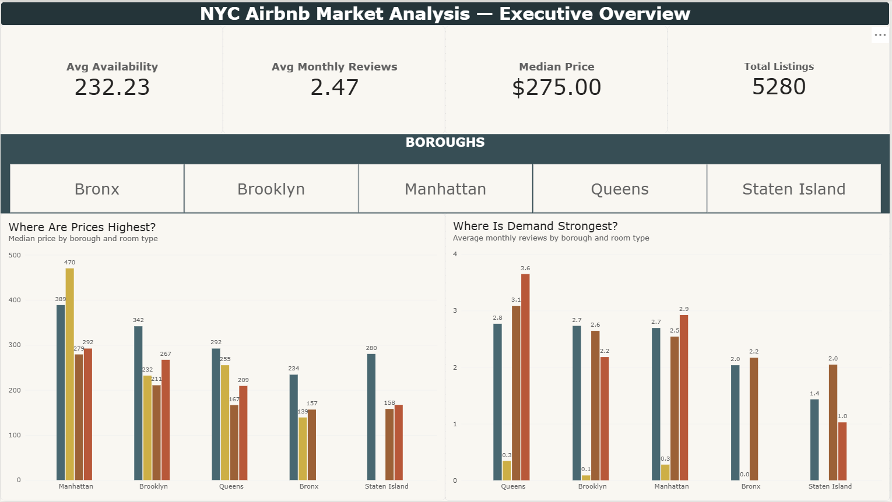
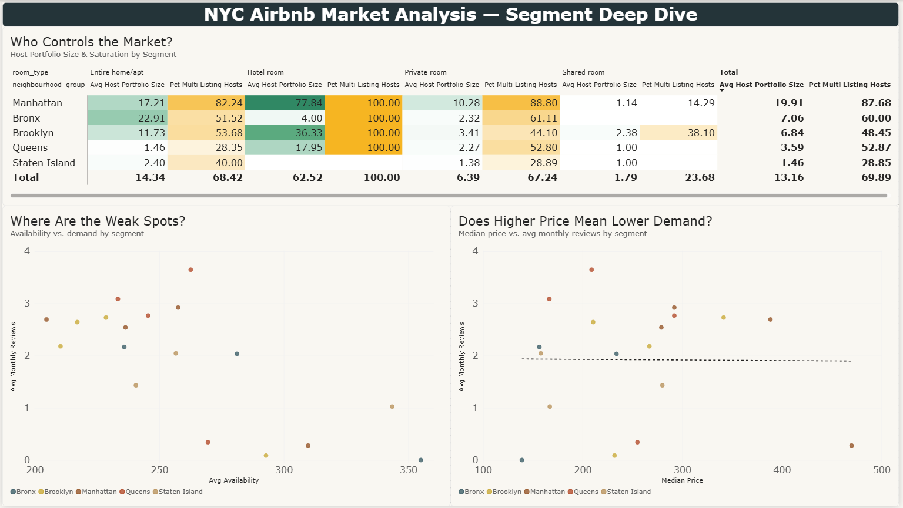

# NYC Airbnb Market Analysis

An end-to-end data analytics project: SQL → Python → Power BI, answering a real business
question for a fictional NYC property management company using public Airbnb data.

---

## Problem Statement

**Stakeholder:** A property management company that provides Airbnb host management
services (dynamic pricing, guest turnover, calendar management) across New York City.

**Decision the business needs to make:** which NYC neighborhood × room-type market
segments to prioritize when signing new host listings, and what pricing guidance to give
hosts once signed.

**Business questions this project answers:**
1. Which neighborhood × room-type segments command the highest price?
2. Which segments show the strongest guest demand?
3. Which segments are already saturated by professional, multi-listing hosts?
4. Which segments are structurally weak-performing (low demand *and* low bookings)?
5. Is there a simple relationship between price and demand across the market?

Full detail and the reasoning behind every conclusion is in [`insights.md`](insights.md).

## Dataset

[Inside Airbnb](https://insideairbnb.com/) — New York City `listings.csv` snapshot,
dated **10 August 2026**.
Source: https://data.insideairbnb.com/united-states/ny/new-york-city/2026-08-10/visualisations/listings.csv

30,234 raw listings, 19 columns. After cleaning (see below), the analysis works from
**5,280 active, genuinely short-term listings**.

## Tools Used

| Tool | Role in this project |
|---|---|
| **PostgreSQL** | Schema design, data cleaning, and all exploratory/analytical SQL (CTEs, window functions, joins) |
| **Python** (pandas, matplotlib, seaborn) | Independent validation of the SQL cleaning, outlier detection, and EDA visualization |
| **Power BI Desktop** | Live PostgreSQL-connected dashboard with DAX measures |
| **Git / GitHub** | Version control and public portfolio hosting |

## Project Structure

```
├── data/
│   ├── listings.csv              # raw Inside Airbnb snapshot
│   └── listings_cleaned.csv      # exported copy of the cleaned listings_clean table
│
├── sql/
│   ├── 01_create_tables.sql      # raw table schema
│   ├── 02_data_cleaning.sql      # builds listings_clean, every exclusion documented
│   ├── 03_eda_queries.sql        # exploratory SQL — counts, medians, distributions
│   └── 04_analysis_queries.sql   # answers the 5 business questions (CTEs, window functions, JOIN, CORR)
│
├── python/
│   └── eda_analysis.ipynb        # cleaning validation + outlier detection + visualizations
│
├── powerbi/
│   ├── NYC Airbnb Market Analysis.pbix   # live PostgreSQL-connected dashboard
│   ├── NYC Airbnb Market Analysis.pdf    # static PDF export
│   └── screenshots/
│       ├── dashboard_overview.png
│       └── dashboard_segment_deep_dive.png
│
├── insights.md                   # full findings, recommendations, limitations
└── README.md
```

## Approach

This project follows a standard analytics workflow: **Problem → Questions → Data → Clean
→ Explore → Analyze → Visualize → Story → Share.**

1. **Business Understanding & Questions** — defined the stakeholder, the decision at
   stake, and translated it into 5 specific, answerable data questions (see Problem
   Statement above).
2. **Data Discovery** — loaded the raw CSV into PostgreSQL (`01_create_tables.sql`),
   profiled null rates, data types, and time range before touching anything.
3. **Data Cleaning** (`02_data_cleaning.sql`) — built `listings_clean` from the raw table
   without ever modifying it. Two filters excluded listings with no active price and
   listings with a 30+ night minimum stay (a well-documented pattern of hosts sidestepping
   NYC's Local Law 18 short-term-rental restrictions), narrowing the scope to the actual
   short-term rental market this business operates in.
4. **Exploratory Data Analysis** — done twice, deliberately: SQL EDA (`03_eda_queries.sql`)
   for exact counts and distributions, then Python EDA (`eda_analysis.ipynb`) to visualize
   what the numbers alone don't make obvious (skew, spread, outliers) and to independently
   verify the cleaning worked.
5. **Analysis** (`04_analysis_queries.sql`) — answered all 5 business questions using CTEs,
   window functions (`RANK`, `DENSE_RANK`, `NTILE`), a composite-key `JOIN`, and `CORR()`.
6. **Visualization** — a two-page Power BI dashboard with a live PostgreSQL connection: an
   executive Overview page and a cross-segment Segment Deep Dive page, deliberately not
   slicer-synced so the deep-dive comparison is never silently filtered down to one borough.
7. **Storytelling** (`insights.md`) — translated the SQL findings into plain-language
   conclusions and business recommendations for a non-technical audience.

## Key Findings

- **Entire home/apt** is the strongest overall segment — best or tied-best on combined
  price and demand in 4 of 5 boroughs.
- **Manhattan Hotel room** has the single highest median price in the dataset ($470) but
  is simultaneously the *lowest*-demand room type in every borough, 100% saturated by
  professional multi-listing hosts, and independently flagged as weak-performing —
  four separate analyses agreeing that the highest price tag here is not a strong segment.
- The city-wide correlation between price and demand is close to zero (r = −0.009) — not
  because price and demand are unrelated, but because opposite segment-level patterns
  (Hotel room's negative relationship vs. Brooklyn Entire home/apt's positive one) cancel
  out at the aggregate level.

Full findings, the reasoning behind them, tiered recommendations, and limitations are in
[`insights.md`](insights.md).

## Dashboard Preview




## How to Run This Project Locally

**Requirements:** PostgreSQL, Python 3.x, Power BI Desktop (Windows only).

1. **Clone the repo** and open it in your editor of choice.
2. **Set up the database:**
   - Create a PostgreSQL database (e.g. `data_analyst_project`).
   - Run `sql/01_create_tables.sql` to create the `listings_raw` schema.
   - Import `data/listings.csv` into `listings_raw` (e.g. via pgAdmin's import wizard, or
     `psql`'s `\copy` command).
   - Run `sql/02_data_cleaning.sql` to build `listings_clean`.
   - Run `sql/03_eda_queries.sql` and `sql/04_analysis_queries.sql` to reproduce the
     exploratory and analytical results.
3. **Run the Python notebook:**
   - `pip install pandas sqlalchemy psycopg2-binary matplotlib seaborn jupyter`
   - Open `python/eda_analysis.ipynb` and run all cells. You'll be prompted for your
     PostgreSQL password at runtime (via `getpass`) — it is never stored in the notebook.
4. **Open the Power BI dashboard:**
   - Open `powerbi/NYC Airbnb Market Analysis.pbix` in Power BI Desktop.
   - Update the PostgreSQL data source connection (Transform Data → Data Source Settings)
     to point at your local database, then Refresh.

## Limitations

This analysis uses `reviews_per_month` as a proxy for booking demand (Airbnb's public data
has no real booking count), reflects a single point-in-time snapshot rather than a trend,
and is scoped to short-term listings only. Full detail in [`insights.md`](insights.md).

## Author

Built as a portfolio project to demonstrate an end-to-end SQL → Python → Power BI
analytics workflow, from raw data through business recommendations.
